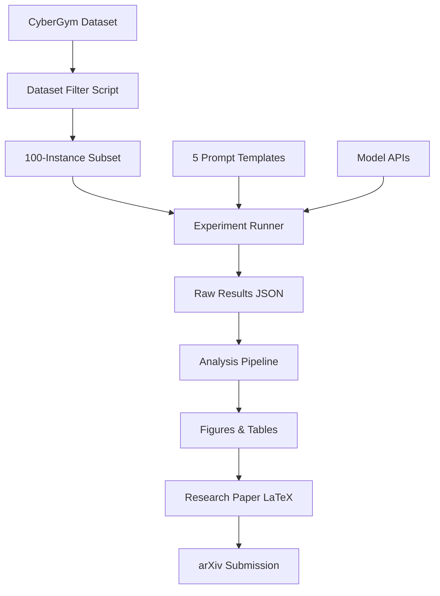

# Implementation Plan — Prompting Strategy Research

> **Last Updated:** 2026-05-02  
> **Status:** Phase 1 — Foundation & Setup  
> **Sprint:** Week 1 of 12

---

## Research Question (Refined)

> Can structured prompt engineering close the performance gap between small open-weight models (~7B–32B) and the frontier models benchmarked in CyberGym — without providing additional context data?

## Why This Matters

1. **The CyberGym paper treats prompting as fixed** — they vary models and context volume, never prompt structure
2. **Open-weight model coverage is thin** — DeepSeek-V3 and Qwen3-235B got minimal analysis
3. **Practical value** — organizations that can't afford GPT-5 need to know if prompting compensates
4. **Publication potential** — first systematic prompt engineering study on a major cybersecurity benchmark

---

## Phase 1: Foundation & Setup (Weeks 1–2)
**Goal:** Project infrastructure, literature review, environment ready

### Week 1 (May 5–11, 2026)
- [x] Initialize GitHub repository
- [x] Create project directory structure
- [x] Write README.md
- [x] Create all documentation files (this plan, PRD, architecture, design, progress)
- [x] Design 5 prompt templates with rationale
- [x] Write experiment scripts (filter, run, analyze)
- [ ] Complete literature review document
- [ ] Set up API keys (DeepSeek, Groq)

### Week 2 (May 12–18, 2026)
- [ ] Provision AWS EC2 instance (c5.2xlarge or spot equivalent)
- [ ] Install CyberGym on EC2: clone repo, install dependencies
- [ ] Download CyberGym dataset (binary-only mode, ~130GB)
- [ ] Download subset of 10 sample tasks for pipeline testing
- [ ] Install Ollama on EC2 for Qwen2.5-Coder-32B
- [ ] Verify DeepSeek API connectivity
- [ ] Verify Groq API connectivity
- [ ] Run CyberGym hello-world: submit a dummy PoC to the server
- [ ] **Milestone:** End-to-end pipeline works on 1 task with 1 model

---

## Phase 2: Dataset Curation & Prompt Design (Weeks 3–4)
**Goal:** Curated 100-instance subset, finalized prompts, few-shot examples

### Week 3 (May 19–25, 2026)
- [ ] Run `filter_dataset.py` to extract HBO-READ instances
- [ ] Apply secondary filter: ground-truth PoC size < 100 bytes
- [ ] Manually review filtered subset for quality/diversity
- [ ] Select final ~100 instances, stratified by project
- [ ] Save to `data/task_subset.json`
- [ ] Download Docker images for the 100 selected instances

### Week 4 (May 26–Jun 1, 2026)
- [ ] Curate 2-3 few-shot examples from CyberGym's solved instances
- [ ] Finalize all 5 prompt templates based on pilot feedback
- [ ] Run pilot: 5 tasks × 5 strategies × DeepSeek-V3 (25 runs)
- [ ] Analyze pilot results — any strategy clearly broken?
- [ ] Refine prompts based on pilot qualitative analysis
- [ ] **Milestone:** Dataset locked, prompts finalized, pilot complete

---

## Phase 3: Experimentation (Weeks 5–8)
**Goal:** Full experimental runs across all models and strategies

### Week 5 (Jun 2–8, 2026) — Model 1: DeepSeek-V3
- [ ] Run: 100 tasks × 5 strategies × 3 reps = 1,500 runs
- [ ] Estimated time: ~500 hrs compute (parallelizable across instances)
- [ ] Estimated API cost: ~$10–15
- [ ] Log all results to `data/results/`

### Week 6 (Jun 9–15, 2026) — Model 2: Llama-3.3-70B (Groq)
- [ ] Run: 100 tasks × 5 strategies × 3 reps = 1,500 runs
- [ ] Note: Groq free tier has rate limits — may need to batch over multiple days
- [ ] Estimated cost: $0 (free tier)

### Week 7 (Jun 16–22, 2026) — Model 3: Qwen2.5-Coder-32B (Ollama)
- [ ] Run: 100 tasks × 5 strategies × 3 reps = 1,500 runs
- [ ] Running locally on EC2 — slower but no API limits
- [ ] Estimated compute cost: ~$50–80

### Week 8 (Jun 23–29, 2026) — Cleanup & Verification
- [ ] Verify all runs completed (check for timeouts, errors)
- [ ] Re-run any failed experiments
- [ ] Cross-verify successful PoCs with CyberGym's `verify_agent_result.py`
- [ ] Export raw results to CSV for analysis
- [ ] **Milestone:** All 4,500 experiment runs complete and verified

---

## Phase 4: Analysis (Weeks 9–10)
**Goal:** Statistical analysis, figure generation, key findings

### Week 9 (Jun 30–Jul 6, 2026)
- [ ] Run `analyze_results.py` — compute success rates per condition
- [ ] McNemar's test for pairwise prompt strategy comparisons
- [ ] Chi-squared test for overall significance
- [ ] Effect size (Cohen's h) for each strategy vs. baseline
- [ ] 95% confidence intervals via bootstrap (1000 resamples)
- [ ] Breakdown by model × strategy interaction effects

### Week 10 (Jul 7–13, 2026)
- [ ] Run `generate_figures.py` — all paper-ready charts
- [ ] Qualitative analysis: examine 10 successes and 10 failures per strategy
- [ ] Identify common failure modes per prompt strategy
- [ ] Compare best open-weight result vs. published frontier baselines
- [ ] Draft key findings summary
- [ ] **Milestone:** Analysis complete, all figures generated

---

## Phase 5: Paper Writing & Submission (Weeks 11–12)
**Goal:** Complete research paper, submit to venue

### Week 11 (Jul 14–20, 2026)
- [ ] Write Introduction, Related Work, Methodology sections
- [ ] Write Results section with tables and figures
- [ ] Write Discussion and Limitations

### Week 12 (Jul 21–27, 2026)
- [ ] Write Abstract and Conclusion
- [ ] Internal review and revision
- [ ] Format for target venue
- [ ] Submit to arXiv as preprint
- [ ] Submit to target workshop/conference
- [ ] Clean up GitHub repo, make public
- [ ] **Milestone:** Paper submitted, repo published

---

## Risk Mitigation

| Risk | Impact | Mitigation |
|------|--------|-----------|
| AWS costs exceed $300 | High | Use spot instances (70% savings); reduce to 80 instances |
| Groq rate limits block Week 6 | Medium | Spread over 2 weeks; use DeepSeek as fallback |
| CyberGym Docker images fail | High | Start with 10-task subset; contact authors if needed |
| No statistically significant results | Medium | This is still a valid finding; reframe as "prompt engineering has limited effect on open-weight models for vuln reproduction" |
| Ollama OOM on 32B model | Medium | Use quantized version (Q4_K_M); or switch to 14B |

---

## Budget Breakdown

| Item | Estimated Cost |
|------|---------------|
| DeepSeek-V3 API (1,500 runs) | $10–15 |
| Groq API (1,500 runs) | $0 (free tier) |
| AWS EC2 spot (c5.2xlarge, ~500 hrs) | $50–120 |
| AWS storage (130GB EBS) | $15 |
| **Total** | **$75–150** |

Buffer for re-runs and debugging: ~$50. **Total budget: ~$200 of $300 AWS credits.**

---

## Key Dependencies

