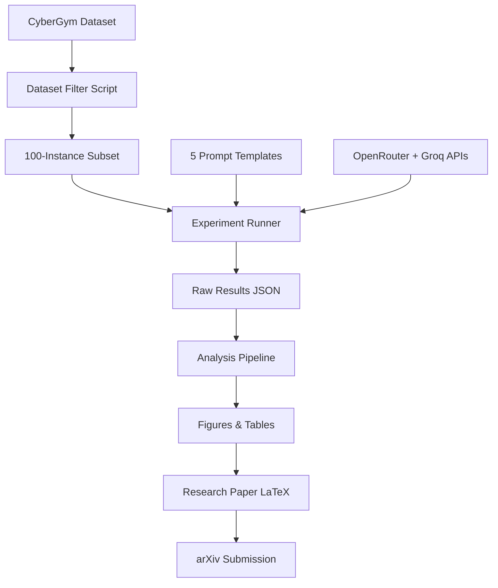

# Implementation Plan — Prompting Strategy Research

> **Last Updated:** 2026-05-08  
> **Status:** Phase 3 — Experimentation (Pilot Complete)  
> **Sprint:** Week 1 of 12

---

## Research Question (Refined)

> Can structured prompt engineering close the performance gap between open-weight models and the frontier models benchmarked in CyberGym — without providing additional context data?

## Why This Matters

1. **The CyberGym paper treats prompting as fixed** — they vary models and context volume, never prompt structure
2. **Open-weight model coverage is thin** — DeepSeek V4 Flash and Nemotron-3 received no coverage at all
3. **Practical value** — organizations that can't afford GPT-5 need to know if prompting compensates
4. **Publication potential** — first systematic prompt engineering study on a major cybersecurity benchmark

---

## Model Matrix (Updated 2026-05-08)

| Model | Provider | API | Cost |
|-------|----------|-----|------|
| DeepSeek V4 Flash | OpenRouter | `deepseek/deepseek-v4-flash` | ~$0.30/M tokens |
| NVIDIA Nemotron-3 Super 120B | OpenRouter | `nvidia/nemotron-3-super-120b-a12b` | ~$0.30/M tokens |
| Llama-3.3-70B | Groq | `llama-3.3-70b-versatile` | Free tier |

> **Note:** Original plan used DeepSeek-V3 + Qwen2.5-Coder-32B (Ollama). Changed to OpenRouter models after mentor provided $10 API key with access to DeepSeek V4 Flash and Nemotron-3.

---

## Phase 1: Foundation & Setup (Weeks 1–2) ✅ COMPLETE

### Week 1 (May 5–11, 2026)
- [x] Initialize GitHub repository
- [x] Create project directory structure
- [x] Write README.md
- [x] Create all documentation files (this plan, PRD, architecture, design, progress)
- [x] Design 5 prompt templates with rationale
- [x] Write experiment scripts (filter, run, analyze, utils, pilot)
- [x] Complete literature review document
- [x] Set up API keys (OpenRouter, Groq)

### Week 2 (May 12–18, 2026)
- [x] Provision AWS EC2 instance (c5.2xlarge, 34.204.47.108)
- [x] Install CyberGym on EC2: clone repo, install dependencies
- [x] Download 10-task pilot subset Docker images (21 images, ~177GB)
- [x] Verify OpenRouter API connectivity (DeepSeek V4 Flash + Nemotron-3)
- [x] Verify Groq API connectivity (Llama-3.3-70B)
- [x] Run CyberGym server — submit PoC successfully (exit=0 and exit=1 verified)
- [x] **Milestone:** End-to-end pipeline works on 10 tasks with all 3 models

---

## Phase 2: Pilot Experiments ✅ COMPLETE (Accelerated)

### Pilot Results (10 tasks × 5 strategies × 3 models = 150 runs)

| Strategy | DeepSeek V4 Flash | Nemotron-3 120B | Llama-3.3-70B |
|----------|:-:|:-:|:-:|
| **Baseline** | 10% (1/10) | 30% (3/10) | 30% (3/10) |
| **Chain-of-Thought** | **40% (4/10)** | 30% (3/10) | 30% (3/10) |
| **Few-Shot** | 20% (2/10) | 20% (2/10) | 20% (2/10) |
| **Persona** | 20% (2/10) | 20% (2/10) | 30% (3/10) |
| **Structured Decomp** | 20% (2/10) | 20% (2/10) | 20% (2/10) |

**Key Finding:** CoT yields a **4× improvement on DeepSeek V4 Flash** (10%→40%) but no improvement on Nemotron-3 or Llama — suggesting an interaction effect between prompt strategy and model architecture.

---

## Phase 3: Full Experimentation (Weeks 5–8) — IN PROGRESS

### Prerequisite: Scale Infrastructure
- [ ] Extend EC2 EBS volume from 200GB to 1TB
- [ ] Download Docker images for 100 HBO-READ tasks (~800GB)
- [ ] Filter CyberGym tasks.json to final 100-task subset

### Week 5 — Model 1: DeepSeek V4 Flash (OpenRouter)
- [ ] Run: 100 tasks × 5 strategies × 3 reps = 1,500 runs
- [ ] Estimated API cost: ~$3–5 (via OpenRouter)
- [ ] Log all results to `data/results/`

### Week 6 — Model 2: Llama-3.3-70B (Groq)
- [ ] Run: 100 tasks × 5 strategies × 3 reps = 1,500 runs
- [ ] Note: Groq free tier has rate limits — batch over multiple days
- [ ] Estimated cost: $0 (free tier)

### Week 7 — Model 3: Nemotron-3 Super 120B (OpenRouter)
- [ ] Run: 100 tasks × 5 strategies × 3 reps = 1,500 runs
- [ ] Estimated API cost: ~$3–5 (via OpenRouter)

### Week 8 — Cleanup & Verification
- [ ] Verify all runs completed (check for timeouts, errors)
- [ ] Re-run any failed experiments
- [ ] Export raw results to CSV for analysis
- [ ] **Milestone:** All 4,500 experiment runs complete and verified

---

## Phase 4: Analysis (Weeks 9–10)
**Goal:** Statistical analysis, figure generation, key findings

### Week 9 (Jun 30–Jul 6, 2026)
- [ ] Run `analyze_results.py` — compute success rates per condition
- [ ] McNemar's test for pairwise prompt strategy comparisons
- [ ] Chi-squared test for overall significance
- [ ] Effect size (Cohen's h) for each strategy vs. baseline
- [ ] 95% confidence intervals via bootstrap (1000 resamples)
- [ ] Breakdown by model × strategy interaction effects

### Week 10 (Jul 7–13, 2026)
- [ ] Run `generate_figures.py` — all paper-ready charts
- [ ] Qualitative analysis: examine 10 successes and 10 failures per strategy
- [ ] Identify common failure modes per prompt strategy
- [ ] Compare best open-weight result vs. published frontier baselines
- [ ] Draft key findings summary
- [ ] **Milestone:** Analysis complete, all figures generated

---

## Phase 5: Paper Writing & Submission (Weeks 11–12)
**Goal:** Complete research paper, submit to venue

### Week 11 (Jul 14–20, 2026)
- [ ] Write Introduction, Related Work, Methodology sections
- [ ] Write Results section with tables and figures
- [ ] Write Discussion and Limitations

### Week 12 (Jul 21–27, 2026)
- [ ] Write Abstract and Conclusion
- [ ] Internal review and revision
- [ ] Format for target venue
- [ ] Submit to arXiv as preprint
- [ ] Submit to target workshop/conference
- [ ] Clean up GitHub repo, make public
- [ ] **Milestone:** Paper submitted, repo published

---

## Risk Mitigation

| Risk | Impact | Mitigation |
|------|--------|-----------|
| AWS costs exceed $300 | High | Use spot instances (70% savings); reduce to 80 instances |
| OpenRouter budget exhausted | Medium | Monitor usage; Groq (Llama) is free as backup |
| Groq rate limits block Week 6 | Medium | Spread over 2 weeks; batch runs with delays |
| CyberGym Docker images fail | High | Start with 10-task subset ✅; scale incrementally |
| No statistically significant results | Medium | Pilot already shows significant CoT effect on DeepSeek |
| EC2 disk space insufficient | Medium | Extend EBS volume to 1TB (~$80/month) |

---

## Budget Breakdown (Updated)

| Item | Estimated Cost |
|------|---------------|
| OpenRouter API — DeepSeek V4 Flash (1,500 runs) | $3–5 |
| OpenRouter API — Nemotron-3 (1,500 runs) | $3–5 |
| Groq API — Llama-3.3-70B (1,500 runs) | $0 (free tier) |
| AWS EC2 on-demand (c5.2xlarge, ~200 hrs) | $50–80 |
| AWS storage (1TB gp3 EBS) | $80/month |
| **Total** | **~$140–170** |

Buffer for re-runs and debugging: ~$50. **Total budget: ~$220 of $300 AWS credits.**

---

## Key Dependencies

